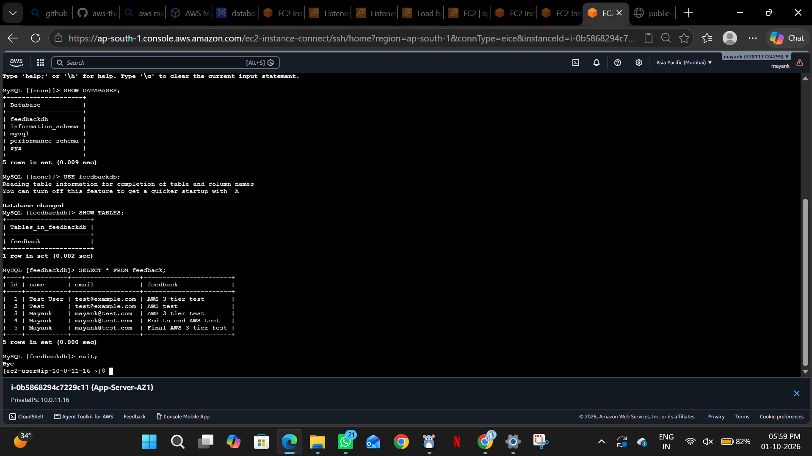

# AWS 3-Tier Architecture on AWS

A scalable, secure, and highly available web application architecture built using AWS services.

## Project Overview

This project demonstrates a three-tier architecture on AWS, separating the web, application, and database layers for improved security, scalability, and maintainability.

## Architecture

- *Web Tier:* EC2 with Nginx and a public Application Load Balancer.
- *Application Tier:* Flask application running with Gunicorn on private EC2 instances, behind an internal Application Load Balancer.
- *Database Tier:* Amazon RDS for MySQL in private subnets.

## AWS Services Used

- Amazon VPC
- Public and private subnets across Availability Zones
- Internet Gateway and NAT Gateway
- Amazon EC2
- Application Load Balancer (public and internal)
- Security Groups and Route Tables
- Amazon RDS for MySQL
- Nginx
- Python, Flask, Gunicorn, PyMySQL

## Network Design

The VPC uses six subnets distributed across Availability Zones:

- Public subnets for internet-facing resources.
- Private subnets for application servers.
- Database subnets for the RDS layer.

The public load balancer receives incoming web traffic. Nginx forwards application requests to the internal load balancer, which distributes them to the Flask application instances. The application connects to the MySQL database.

## Application

The backend is developed using Python Flask and served using Gunicorn on port 50000.

The application uses PyMySQL to communicate with the RDS MySQL database.

## Security

- Application and database resources are placed in private subnets.
- Security Groups control communication between tiers.
- The database is not intended to be directly accessible from the public internet.
- NAT Gateway provides outbound internet access for private resources when required.

## High Availability and Scalability

The application tier uses instances across Availability Zones behind an internal load balancer. Load balancing and health checks help distribute requests and identify unhealthy targets.

## Documentation

See [Detailed Implementation Document](AWS_3_Tier_Project_Detailed_Implementation_Document.pdf) for the project implementation details.

## Project Outcome

The project demonstrates the deployment and integration of a multi-tier web application on AWS, including networking, load balancing, application hosting, database connectivity, and security controls.

## Author

Mayank Gurjar

GitHub: https://github.com/mayankgurjar0

## Database Tier - SQL Output

Screenshot showing stored feedback records in Amazon RDS MySQL.

